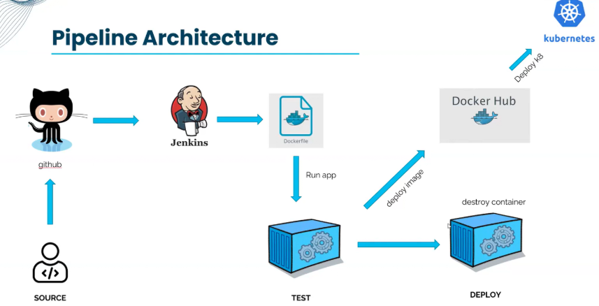

# jenkins-docker-k8s-pipeline
This project demonstrates a complete **CI/CD pipeline** for containerized applications using: **Jenkins**, **Docker**, **Docker Hub**, and **Kubernetes**.

It automates the entire workflow — from code commit to deployment — following cloud-native DevOps best practices.

